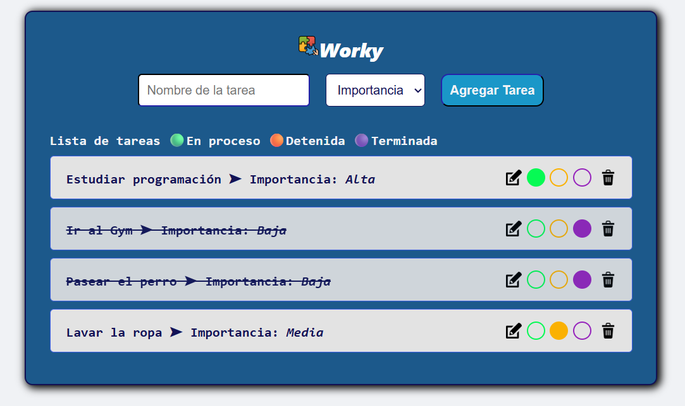

# 📝 Worky - To-Do List en JavaScript, HTML y CSS

**Worky** es una aplicación web minimalista de lista de tareas desarrollada con **JavaScript, HTML y CSS puros**. Te permite crear, organizar y gestionar tus tareas con facilidad, visualizando su estado y nivel de prioridad de forma clara e intuitiva.

## 🚀 Funcionalidades principales

- ✅ **Agregar tareas** con un nombre y nivel de importancia (Alta, Media o Baja).
- 🎯 **Editar tareas existentes**, incluyendo su nombre y nivel de prioridad.
- 🔄 **Cambiar el estado** de la tarea con un solo clic:
  - 🟢 En proceso
  - 🟠 Detenida
  - 🔵 Terminada (aplica tachado al texto)
- ❌ **Eliminar tareas individualmente**.
- ♾️ **Agregar múltiples tareas** sin límite.

## 🧩 Tecnologías utilizadas

- **HTML5**: estructura del contenido.
- **CSS3**: estilos personalizados y diseño responsive.
- **JavaScript (Vanilla JS)**: lógica de interacción con el usuario.

## 📸 Vista previa



## 🗂️ Estructura del proyecto

```bash
worky/
├── assets
├── index.html
├── style.css
├── script.js
└── README.md

⚙️ Cómo usar
1. Clona el repositorio:

git clone https://github.com/tuusuario/worky.git

2. Abre el archivo index.html en tu navegador web.

3. Empieza a gestionar tus tareas.

👨‍💻 Autor:

- Eider Tapasco
- Desarrollador web en formación apasionado por crear productos útiles para todos.
